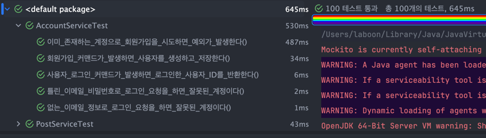
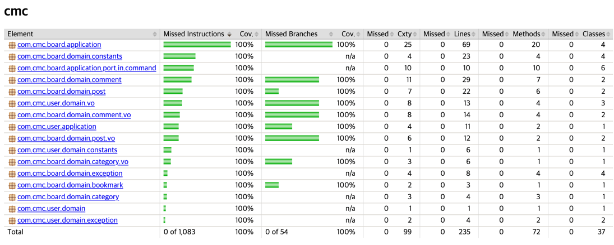

# CMC Board Project

> 📌 실행 방법

``` dotenv
# 💻 macOS, Linux, Git Bash 사용자용 명령어
# ----------------------------------------------------
cp .env.example .env     # 환경 변수 파일 복사
./gradlew clean build    # Gradle을 사용하여 애플리케이션 빌드
docker-compose up -d     # 백그라운드에서 Docker 컨테이너 실행

# 💻 Windows CMD / PowerShell 사용자용 명령어
# ----------------------------------------------------
copy .env.example .env  # Windows용 파일 복사 명령어
./gradlew clean build
docker-compose up -d

(환경에 따라 환경 변수 수정 필요)
```

---

## 📜 Requirements

> 기본 요구사항을 정의 (이 외 요구사항은 자유)

### Client Business

- **글 및 댓글**: 게시글 및 댓글 작성, 수정, 제거를 할 수 있다
- **북마크**: 좋아하는 게시글을 북마크하여 나중에 몰아서 볼 수 있다
- **로그인**: 세션을 통해 로그인을 유지한다

### Admin Business

- **카테고리**: 게시글은 여러 카테고리로 나누어지며, 원하는 새 카테고리를 추가할 수 있다
- **문서**: Swagger 페이지에 접근할 수 있다

---

## 🛠️ Tech Stack

### Language

* Java 25: LTS, JIT 컴파일러 최적화 등 장점 다수

### Framework

* Spring Boot 4.0.0: Java 25 지원
    * Spring Web Mvc: Rest API & Static Page
    * Spring Data JPA: ORM
    * Spring Security: Session Auth
    * Spring Bean Validation: Web Fast fail

### Test

* JUnit: 자바 표준 단위 테스트
* Mockito: 외부 의존성 없이 단위 테스트

### Database

* MySQL 8.0: 장점 다수
* QueryDSL: 타입 안정성 & 카테고리 별 조회 등 동적 쿼리
    * Spring Data Jpa 4.x 부터 OpenFeign QueryDSL 지원

### DevOps

* Docker & Docker Compose: 환경 일관성

### Tool

* Lombok: Boilerplate 제거
* Swagger: 문서화
* Jacoco: 테스트 커버리지
* CheckStyle(고려): 협업 상황이 아니므로 보류

---

## 📊 Test Result



